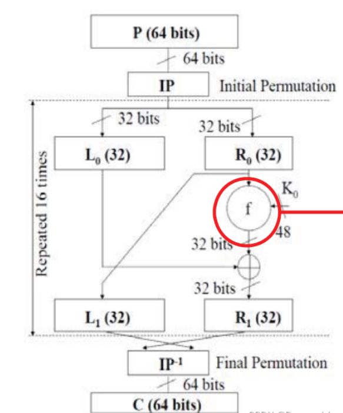
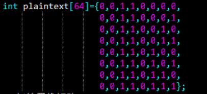
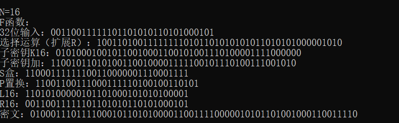
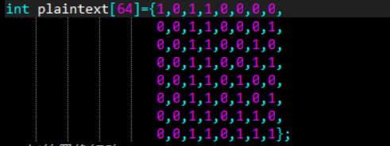
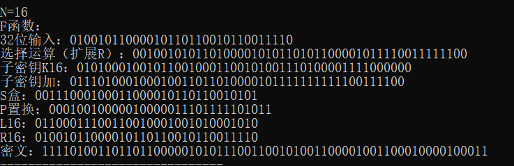
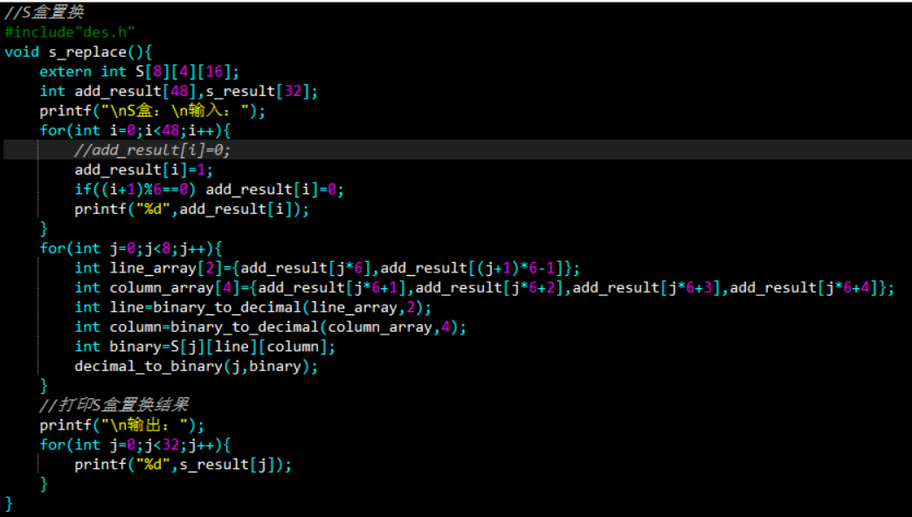
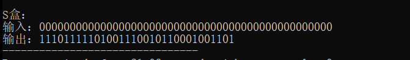
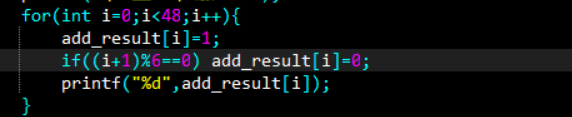
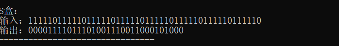

### 第三次作业
1. 利用DES源代码分析明文变化时，1轮、2轮...的变化情况
   - DES加密过程流程图：
       - 
   - 明文变换，分析其变化情况：
       - 明文变化后，经过初始置换后，产生的L0, R0很可能不一致
       - R0扩展后与48位的子密钥做异或运算，然后经过S盒置换，P盒置换，产生的结果作为下一轮的R，原先的R0作为下一轮的L
       - DES加密里涉及的置换、拓展、运算，使得明文变化后，极有可能得到不一样的密文，下面的代码演示将对此进行应证
   - 代码演示：
     - 前一次输入的明文：
        - 
        - 加密后的密文：
          - 
     - 后一次输入的明文：（只改了第一位0为1）
       - 
       - 加密后的密文：
          - 
     - 观察发现：
       - 明文只发生了一位的变化，密文却产生了很多变化  
2. 利用DES源代码对S盒进行穷举分析，验证S盒应该满足的准则5成立
   - S盒满足的准则5：
     - 保持输入中的1位不变，其余5位变化，输出中0和1的个数接近相等
   - S盒验证代码：
     - 
   - 自主测试：改变每个S盒的输入中的一位，观察输出
     - 原先的输入输出：
       -  
     - 变化每个S盒输入的一位：
        - 
     - 变化后的输出结果：
       - 
     - 观察结果：
       - 变化了每个S盒输入的一位后，输出结果中1有15位，0有17位，1和0的个数接近相等，满足准则5
3. 分析c语言随机数生成器源代码
   - 源代码：
```c
// 线性同余法实现的随机数生成器
static unsigned long int next = 1;
int rand(void) {
    next = next * 1103515245 + 12345;
    return (unsigned int)(next / 65536) % 32768;
}
void srand(unsigned int seed) {
    next = seed;
} 
```
 - 观察发现：
   - 随机数实际上是伪随机数
4. 参考资源：
   - [DES加密详解](https://blog.csdn.net/Demonslzh/article/details/129129493)
   - chatgpt
