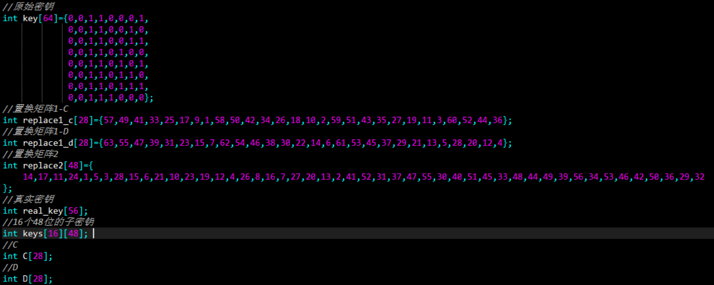
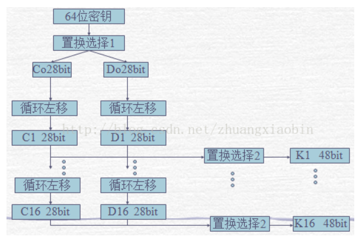
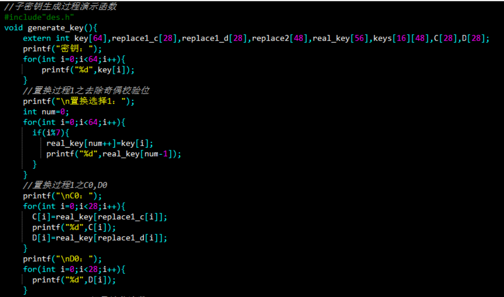
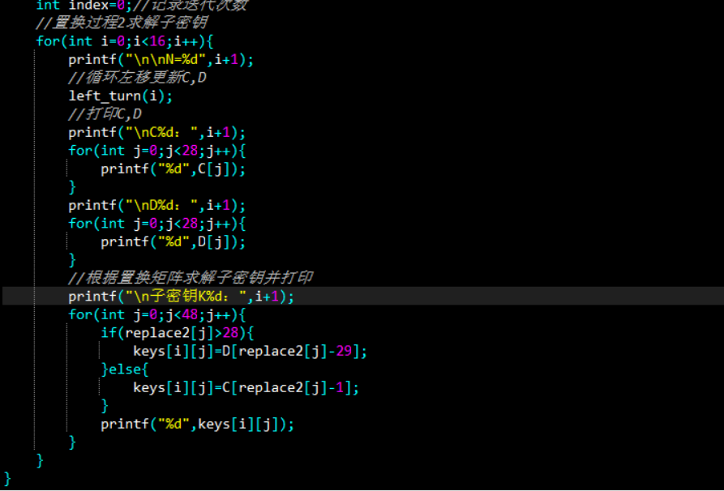
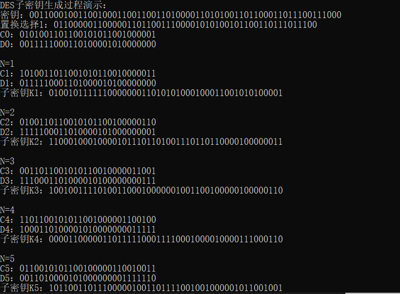
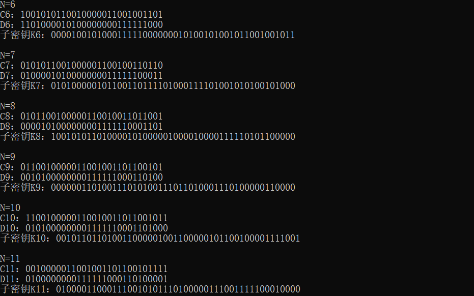
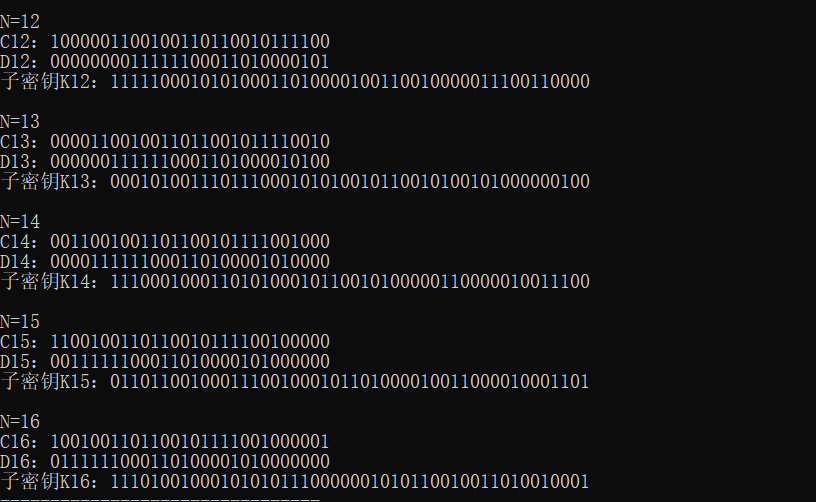

### 第二次作业：DES子密钥生成过程演示实验报告
1. DES子密钥生成过程理论阐述：
   - DES原始密钥64位，去除每个字节的最后一bit的奇偶校验位后只剩下56位真正的密钥
   - 56密钥 分为左右两部分，经过置换矩阵1置换后，到C0, D0
   - 接着进行16轮迭代，每轮迭代都进行循环左移，然后按照置换矩阵2得到48位子密钥
2. 代码实现：
   - 采取语言：C
   - 编译器：DEV C++
   - 数据设计：
     -  
   - 程序流程图：
     - 
   - 代码核心实现：
     - 
     - 
3. 运行结果：
   -  
   -  
   -  
4. 参考资源：
   - [DES子密钥生成详解](https://blog.csdn.net/zhuangxiaobin/article/details/42172619) 