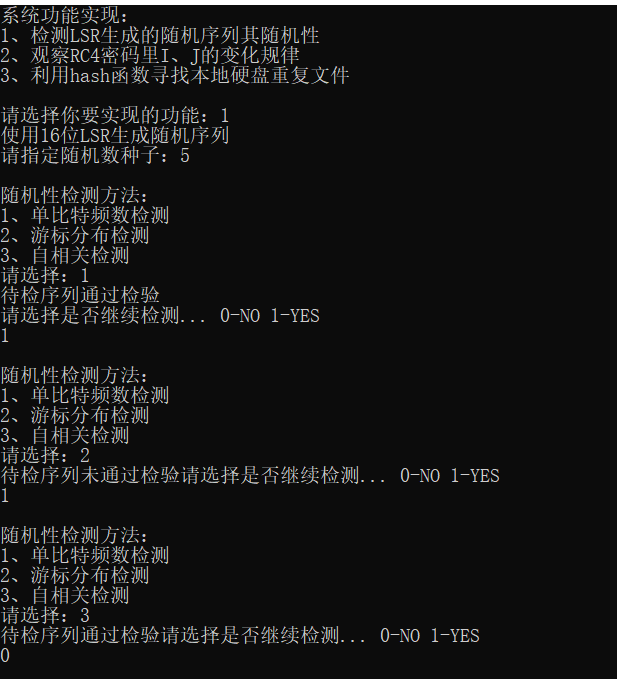
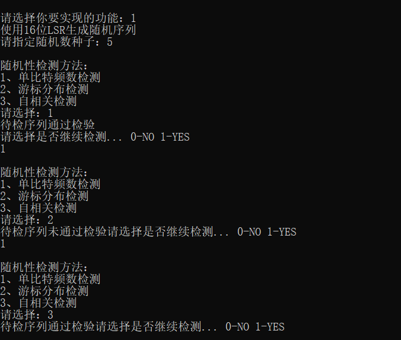
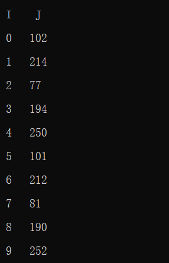
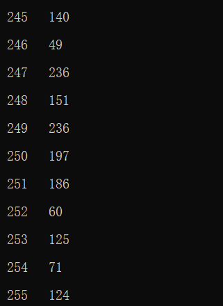
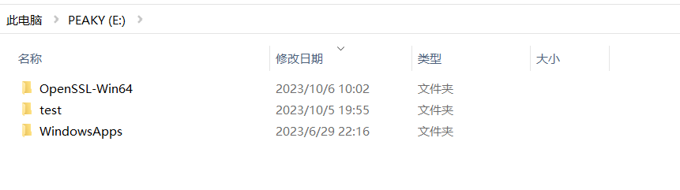
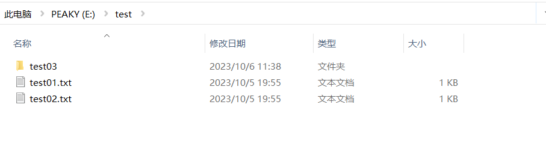
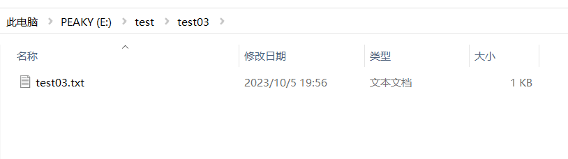
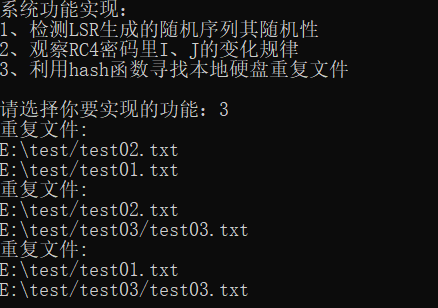

# 第五次作业：LSR、RC4、Hash、区块链
### 一、LSR编程
1. 关于LSR：
   - 是什么：
     - **线性**移位寄存器
   - 特点：
     - 其反馈函数f为**线性**函数 
     - 其输出序列的性质完全由**反馈函数/连接多项式**决定
   - 设计：
     - 16位的线性移位寄存器
     - 每个循环左移寄存器左移一位
2. LSR生成随机序列：
   - 代码实现：
     - 代码实现环境：
        - DEV C++ 
     - 代码实现语言：
       - C
     - 代码实现：
       - int linear_shift_register()
3. 检测随机性：
  
  - 改变连接多项式后，检测随机性：
    - 多项式由11001变为10011，观察到检测结果未变
  
### 二、RC4编程
1. 关于RC4密码：
   - 是什么：
     - 一种序列密码 
   - 特点：
     - 其基于一个足够大的**非线性**数据表变换，产生非线性的密钥序列
     - 密码算法简单、高效，适合于软件实现 
2. RC算法代码实现：
   - 代码实现环境：
      - DEV C++ 
    - 代码实现语言：
      - C
    - 代码实现：
      - void RC4()
3. 观察I，J的变化规律：
   - 每进行一次迭代，I进行一次递增，J则随机变化
  
  
### 三、Hash
1. 关于Hash函数；
   - 用途：
     - 将任意长的数据M映射为定长的Hash码h，可确保数据的真实性和完整性
     - 认证、保密、数字签名
   - 性质：
     - 输入长度任意，输出长度固定
2. 使用hash函数查找本地硬盘重复文件
   - 查找硬盘：
     - E盘：
  
  
  
   - 代码实现：
     - 代码实现环境：
        - DEV C++（安装并配置了OpenSSL、MinGW64编译器）
     - 代码实现语言：
       - C
     - 具体代码实现：
       - 界面函数：void hash()
       - 遍历目录并记录文件哈希值：
void traverseDirectory(const char *dirPath, FileHash hashTable[], int *hashTableSize)
       - 查找重复文件并生成报告：
void findDuplicateFiles(const FileHash hashTable[], int hashTableSize)
       - 计算文件的SHA-256哈希值
int calculateHash(const char *filename, unsigned char hash[SHA256_DIGEST_LENGTH])
3. 查找结果：
   
### 四、区块链
1. 区块链源代码：
```
   func Keccak512(data ...[]byte) []byte {
	d := sha3.NewLegacyKeccak512()
	for _, b := range data {
		d.Write(b)
	}
	return d.Sum(nil)
}
```
2. 解释代码：
   - 首先创建了一个新的Keccak512哈希计算状态对象d
   - 然后循环遍历传递给函数的输入数据片段，将每个数据片段写入Keccak512状态对象d中
   - 最后调用d.Sum(nil)计算最终的哈希值
<hr>参考资源：<br>

1. [移位寄存器](https://www.oschina.net/informat/%E7%A7%BB%E4%BD%8D%E5%AF%84%E5%AD%98%E5%99%A8)
2. RC4-->密码学引论教材
3. [安装配置编译环境](https://blog.csdn.net/zisehuoxia/article/details/106432911)
4. [区块链源码地址集](https://blog.csdn.net/lxt_Lucia/article/details/106824343)
5. [作业里使用的区块链源码](https://github.com/ethereum)
6. chatGPT
