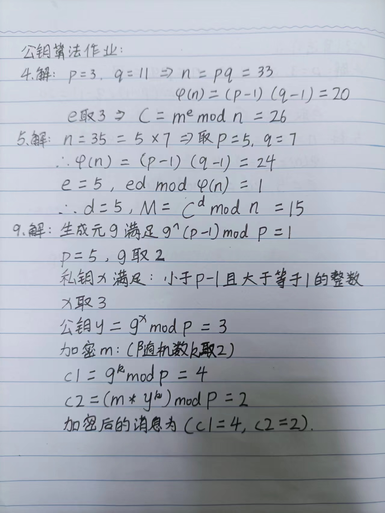
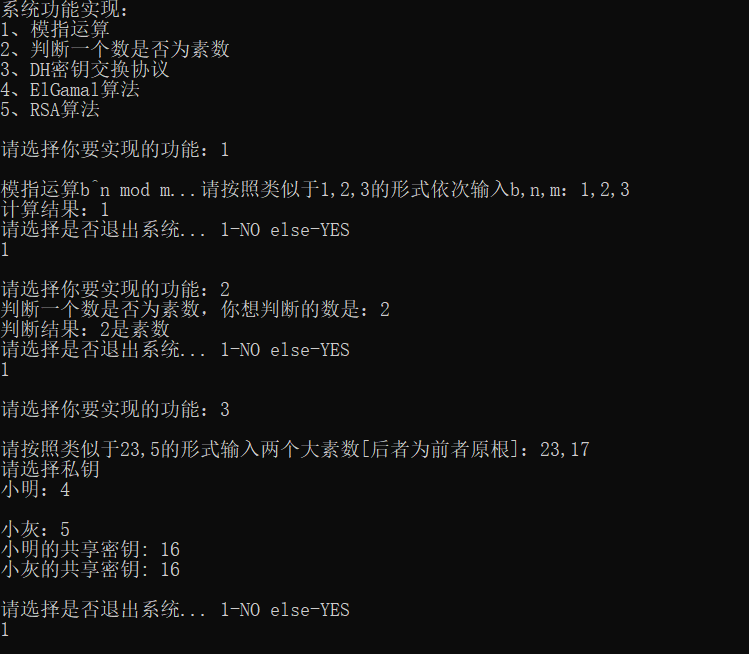
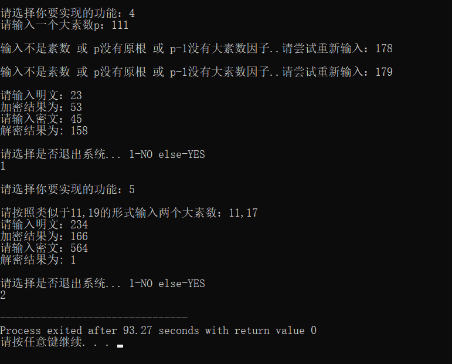

# 第六次作业：RSA算法作业
### 一、课本习题

### 二、编程实现
1. 模指运算：
```  
//模指运算 
int ModExp(int b, int n, int m) {
 	//模数为1，结果为0 
 	if(m == 1) return 0;
 	int result = 1;//记录快速算法的计算结果 
 	b = b % m;//将底数对模数取余
	while (n > 0) {
		//如果指数为奇数，将当前结果乘以底数并对模数取余
		if(n % 2) {
			result = (result * b) % m;
		} 
		//将底数平方并对模数取余，指数减半
		b = (b * b) % m;
		n /= 2; 
	} 
	return result;
}
```
2. 判断一个数是否为素数：
```
//判断一个数是否为素数
bool isPrime(int a) {
	if (a <= 1) return false;
	if (a <= 3) return true;
	if (a % 2 == 0) return false;
	srand(time(NULL));
	//生成k值：[2, n-2] 
	int k = 2 + rand() % (a - 2 + 1);
	//将 a-1表示为 (2^r)*d，d为奇数
	int r = 0, d = a - 1;
	while (d % 2 == 0) {
		r++;
		d /= 2;
	} 
	//进行素性检测
	for (int i = 0; i < k; i++) {
		int witness = 2 + rand() % (a - 3);
		long long x = ModExp(witness, d, a);
		if (x == 1 || x == a - 1) continue;
		for (int j = 0; j < r - 1; j++){
			x = ModExp(x, 2, a);
			if(x == a - 1) break;
		}
		if (x != a - 1) return false;
	} 
	return true;
} 
```   
3. 实现DH密钥交换协议：
```
//DH密钥交换协议
void DH(int p, int g, int a, int b){
    //计算小明的公钥A
    int A = ModExp(g, a, p);
    //计算小灰的公钥B
    int B = ModExp(g, b, p);
    //小明和小灰交换各自的公钥，计算共享密钥
    int sharedKeyA = ModExp(B, a, p);
    int sharedKeyB = ModExp(A, b, p);
    printf("小明的共享密钥: %d\n", sharedKeyA);
    printf("小灰的共享密钥: %d\n", sharedKeyB);
}
```
4. 实现ELGamal密码算法：
```
// ELGamal算法
void ELGamal(int p, int *g_temp, int num){
	//随机选择原根g
	srand(time(NULL));
	int g = g_temp[rand() % num]; 
	//随机生成私钥x
    int x = 2 + rand() % (p - 3);  //私钥x
    //随机选取整数k 
    int k = 2 + rand() % (p - 3);
    //计算公钥y
    int y = ModExp(g, x, p);
    printf("\n请输入明文：");
    int plaintext;
    scanf("%d",&plaintext);getchar();
    //加密
    int encryptedResult = (plaintext * ModExp(y, k, p)) % p;
    printf("加密结果为：%d", encryptedResult);
    int a = ModExp(g, k, p);
    printf("\n请输入密文：");
    int ciphertext;
    scanf("%d",&ciphertext);getchar();
    //解密
    int decryptedResult = (ciphertext * ModExp(a, p - 1 - x, p)) % p;
    printf("解密结果为: %d\n", decryptedResult);
}
```
5. 实现RSA算法：
```
//RSA算法
void RSA(int p, int q){
    //计算n和欧拉函数m 
    int n = p * q;
    int m = (p - 1) * (q - 1);
    //选择公钥e
    int prime[m - 1 - 1];//保存可能的公钥结果 
    int num = 0;//可能的公钥数量 
    for (int i = 2; i < m ; i++) {
    	if(isPrime(i)) prime[num++] =  i; 
	}
	srand(time(NULL));
	int e = prime[rand() % num];
    //计算私钥d
    int d = 0;
    for (int i = 1; i < m; i++) {
        if ((i * e) % m == 1) {
            d = i;
            break;
        }
    }
    printf("请输入明文：");
    int plaintext;
    scanf("%d",&plaintext);getchar();
    //加密
    int encryptedResult = ModExp(plaintext, e, n);
    printf("加密结果为：%d", encryptedResult);
    printf("\n请输入密文：");
    int ciphertext;
    scanf("%d",&ciphertext);getchar();
    //解密
    int decryptedResult = ModExp(ciphertext, d, n);
    printf("解密结果为: %d\n", decryptedResult);
}
```
### 三、运行结果

