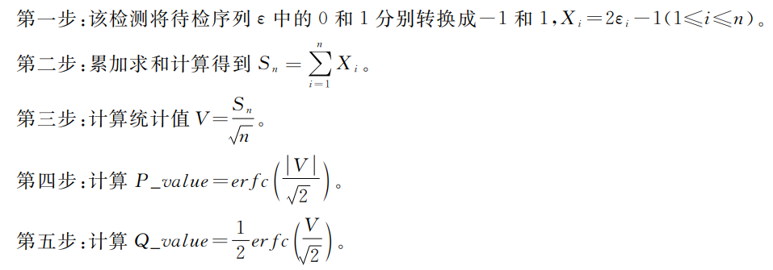
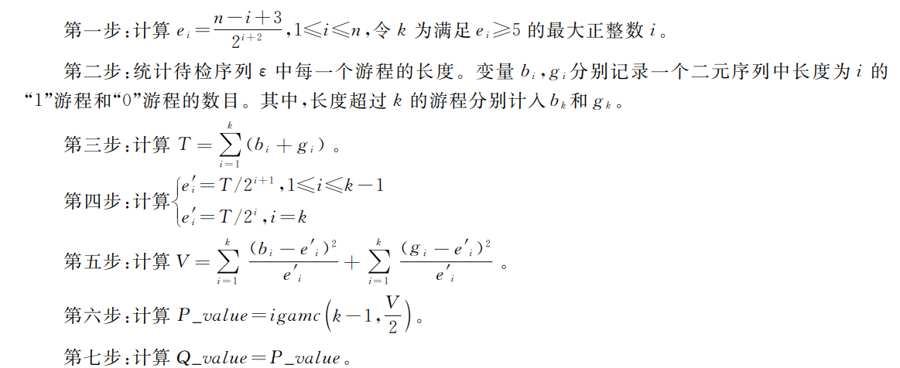
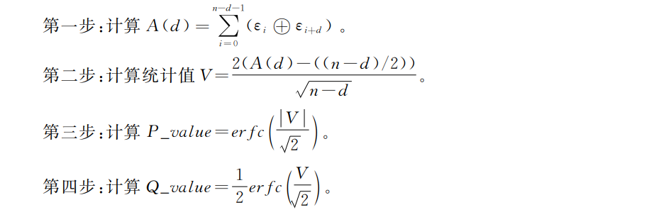

# 第四次作业：实现随机序列检测
### 一、随机序列随机性检测方法
1. 单比特频数检测方法（最基本的检测）
    - 具体检测：
       - 一个二元序列中0和1的个数是否相近
    - 检测步骤：
       - 
2. 游标分布检测：
     - 具体检测：
       - 序列中相同长度游标分布是否均匀
     - 特点：
       - 随机序列中，相同长度的游程数目应接近一致，且游程长度每增加一比特，游程数目应接近减半
     - 检测步骤：
        - 
3. 自相关检测：
     - 具体检测：
       - 待检序列与将其左移（逻辑左移）d位后所得新序列的关联程度
    - 注意：
      - 一个随机序列应该和将其左移任意位所得的新序列都是独立的，所以两个序列进行异或后形成的新序列中，0与1的个数应该接近一致
    - 检测步骤：
      - 
4. 上述随机性检测方法的判定结果为：
    - 将计算得出的P_values与a进行比较，如果前者大于后者，则认为待检序列通过随机性检测，否则不通过检测
### 二、实现随机性检测方法的代码
1. 单比特频率检测：
```
void single_bit_frequency_test(){
    extern int result[RANDOM_LENGTH];
    int X[RANDOM_LENGTH];//保存X 
    int sum = 0;//保存X求和结果 
	//转化待检序列里的0和1
	for(int i = 0; i <= RANDOM_LENGTH; i++){
		if(result[i] == 0) result[i] = -1;
		X[i] = 2 * result[i] - 1; 
		sum += X[i];
	} 
	//计算统计值
	double V = sum / sqrt(RANDOM_LENGTH);
	//计算P_value和Q_value
	double P_value = 1.0 - erf(V / sqrt(2));
	double Q_value = 0.5 * P_value;
	//判定检测结果
	if(P_value >= JUDGE_NUM){
		printf("待检序列通过检验\n");
	}else{
		printf("待检序列未通过检验\n");
	}
}

```
2. 游标分布检测：
```
void cursor_distribution_test() {
	extern int result[16];
	int e[RANDOM_LENGTH];//保存e的结果
	int k = 0;//保存满足e>=5的最大正整数i 
	//计算e和k 
	for(int i = 0; i < RANDOM_LENGTH; i++){
		e[i] = (RANDOM_LENGTH - i + 3)/(1 << (RANDOM_LENGTH + 2));
		if (e[i] >= 5){
			k = i;
		}
	}
	//保存各种游程长度结果 
	int b[k], g[k], length = 1;
	for(int i = 0; i < k; i++){
		b[i] = g[k] = 0;
	}
	for(int i = 0; i < RANDOM_LENGTH; i++){
		if(result[i+1] != result[i]){
			if(result[i] == 0){
				b[length]++;
			}else{
				g[length]++;
			}
		}else{
			length++;
			if(length > k){
				if(result[i] == 0){
					b[k-1]++;
				}else{
					g[k-1]++;
				}
				length = 0;
			}
		}
	}
	//计算T
	int T = 0;
	for(int i = 0; i < k; i++){
		T += (b[i] + g[i]);
	}
	//计算ei
	int ei[k];
	for(int i = 0; i < k; i++){
		if(i == k-1){
			ei[i] = T/(1 << (i + 1));
		}else{
			ei[i] = T/(1 << (i + 2));
		}
	}
	//计算V
	double V = 0;
	for(int i = 0; i < k; i++){
		V += ((b[i] - ei[i]) * (b[i] - ei[i]) / ei[i] + (g[i] - ei[i]) * (g[i] - ei[i]) / ei[i]);
	}
	//计算P_value, Q_value
	double P_value = 1.0 - tgamma(V / 2), Q_value = P_value;
	//判定检测结果
	if(P_value >= JUDGE_NUM){
		printf("待检序列通过检验");
	}else{
		printf("待检序列未通过检验");
	} 
}
```
3. 自相关检测：
```
void autocorrelation_test() {
	extern int leftto_new[RANDOM_LENGTH], result[RANDOM_LENGTH];
	//计算A(d),取d=4
	int A = 0;
	for(int i = 0;i < RANDOM_LENGTH; i++){
		//确定左移后的新序列并保存 
		if(i < RANDOM_LENGTH - D) leftto_new[i] = result[i + D];
		else leftto_new[i] = 0;
		if(result[i] == leftto_new[i]) A += 0;
		else A += 1;
	}
	//计算统计值
	double V = (2*(A-(RANDOM_LENGTH - D) / 2)) / sqrt(RANDOM_LENGTH - D);
	//计算P_value和Q_value
	double P_value = 1.0 - erf(V / sqrt(2));
	double Q_value = 0.5 * P_value;
    //判定检测结果
	if(P_value >= JUDGE_NUM){
		printf("待检序列通过检验");
	}else{
		printf("待检序列未通过检验");
	}
}
```
<hr>参考资源：

 - [GM/T 0005-2021随机性检测规范](https://www.waizi.org.cn/bz/136757.html)
 - chatGPT